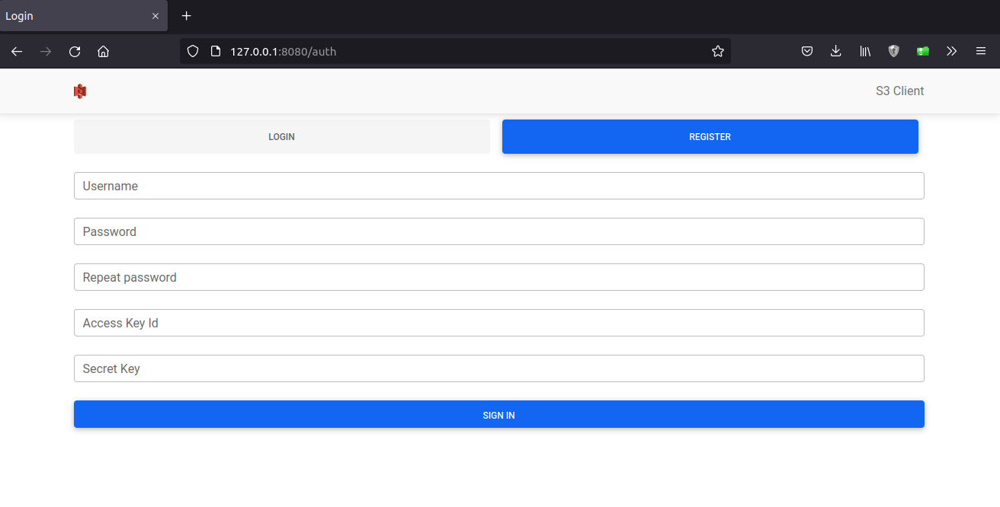
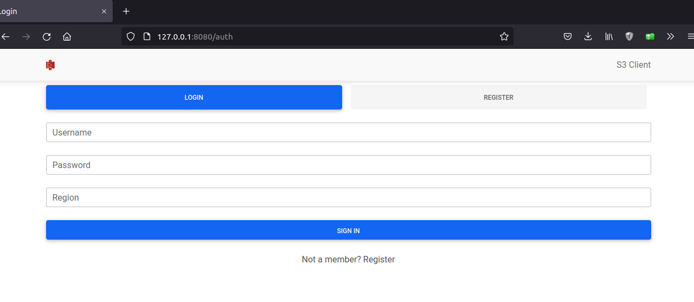
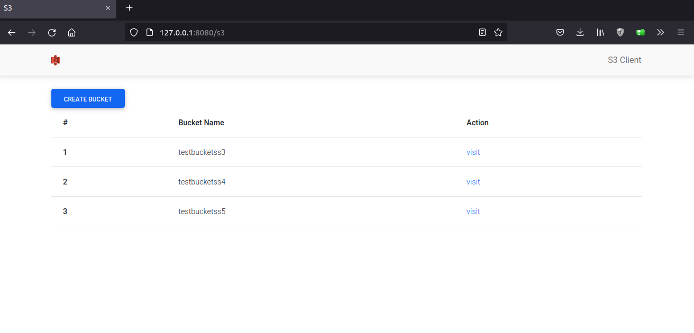
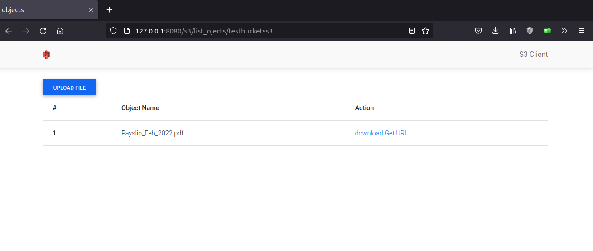
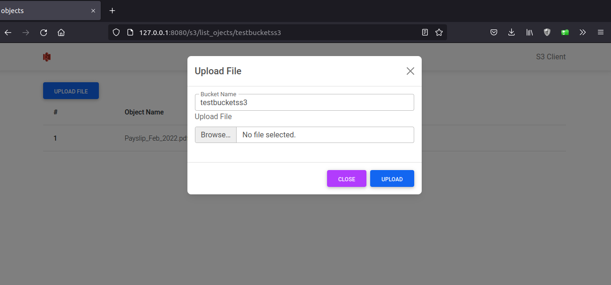

# Experiemental `aws s3` client using `actix-web`  

## This is only for educational purpose

## Application Design

This application handles some of `aws s3` operations and appication built in such a way to handle concurrent users requests  
To use this application you have to sign in

Give following inputs

* USER NAME

* PASSWORD

* AWS_SECRET_KEY_ID

* AWS_ACCESS_KEY_ID

Once sucessfully signed in login to the system

Once loggedin you will be redirected to the `s3 client` home page  where you can view all the buckets that is belonged to the region that you provided at the login time

Here you can `create` the buckets and `visit` the `buckets`

Here you can upload the file by clicking on `upload file` button  

And you can download the particular `object` and get a `presigned_url` with expiry time `5 mins` 